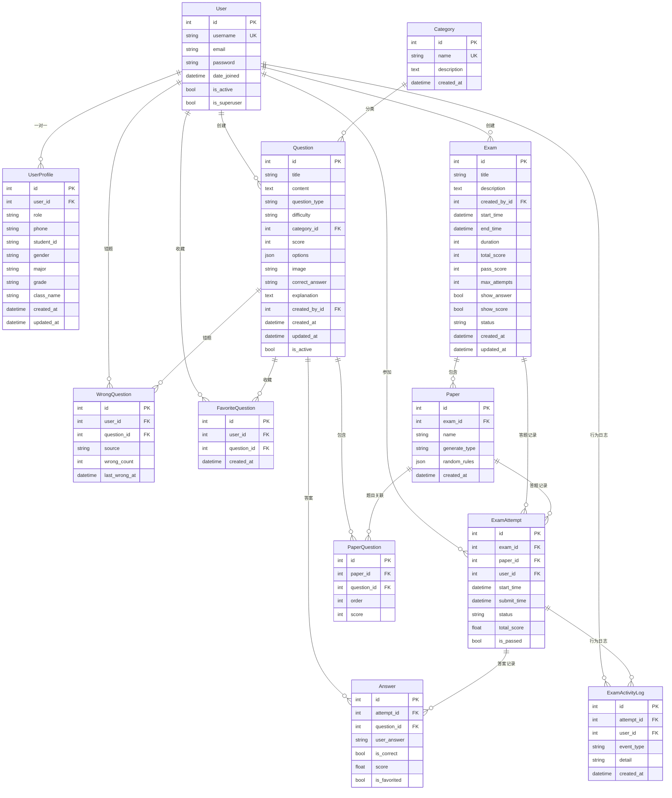

# 智能学习系统 - 数据库ER图

## 📊 实体关系图（ER Diagram）

### Mermaid格式（推荐）



---

## 📋 实体说明

### 核心实体

#### 1. **User** (用户表)
- **来源**: Django内置 `django.contrib.auth.models.User`
- **说明**: 系统用户基础信息
- **主要字段**: username, email, password, is_superuser
- **关系**: 
  - 1:1 → UserProfile（用户扩展信息）
  - 1:N → Question（创建的题目）
  - 1:N → Exam（创建的考试）
  - 1:N → ExamAttempt（参加的考试）

#### 2. **UserProfile** (用户扩展信息)
- **说明**: 用户详细信息，包括角色、学号、专业等
- **主要字段**: role, student_id, major, grade, class_name
- **关系**: N:1 → User

#### 3. **Category** (题目分类)
- **说明**: 题目的分类标签
- **主要字段**: name, description
- **关系**: 1:N → Question

#### 4. **Question** (题目表)
- **说明**: 题库中的题目，支持单选、多选、判断、主观题
- **主要字段**: title, content, question_type, difficulty, options, correct_answer
- **关系**: 
  - N:1 → Category
  - N:1 → User (created_by)
  - 1:N → PaperQuestion
  - 1:N → Answer
  - 1:N → WrongQuestion
  - 1:N → FavoriteQuestion

#### 5. **Exam** (考试表)
- **说明**: 考试的基本信息，包括时间、分数、状态等
- **主要字段**: title, start_time, end_time, duration, total_score, pass_score
- **关系**: 
  - N:1 → User (created_by)
  - 1:N → Paper
  - 1:N → ExamAttempt

#### 6. **Paper** (试卷表)
- **说明**: 试卷，一个考试可以有多个试卷
- **主要字段**: name, generate_type, random_rules
- **关系**: 
  - N:1 → Exam
  - 1:N → PaperQuestion
  - 1:N → ExamAttempt

#### 7. **PaperQuestion** (试卷题目关联表)
- **说明**: 试卷与题目的多对多关系，记录题目顺序和分值
- **主要字段**: order, score
- **关系**: 
  - N:1 → Paper
  - N:1 → Question
- **唯一约束**: (paper, question)

#### 8. **ExamAttempt** (考试答题记录)
- **说明**: 学生参加考试的记录
- **主要字段**: start_time, submit_time, status, total_score, is_passed
- **关系**: 
  - N:1 → Exam
  - N:1 → Paper
  - N:1 → User
  - 1:N → Answer
  - 1:N → ExamActivityLog
- **唯一约束**: (exam, paper, user, start_time)

#### 9. **Answer** (答案记录)
- **说明**: 每道题的答案记录
- **主要字段**: user_answer, is_correct, score, is_favorited
- **关系**: 
  - N:1 → ExamAttempt
  - N:1 → Question
- **唯一约束**: (attempt, question)

#### 10. **ExamActivityLog** (考试行为日志)
- **说明**: 记录考试过程中的行为，用于反作弊
- **主要字段**: event_type, detail, created_at
- **关系**: 
  - N:1 → ExamAttempt
  - N:1 → User

#### 11. **WrongQuestion** (错题本)
- **说明**: 学生答错的题目记录
- **主要字段**: source, wrong_count, last_wrong_at
- **关系**: 
  - N:1 → User
  - N:1 → Question
- **唯一约束**: (user, question)

#### 12. **FavoriteQuestion** (收藏题目)
- **说明**: 学生收藏的题目
- **主要字段**: created_at
- **关系**: 
  - N:1 → User
  - N:1 → Question
- **唯一约束**: (user, question)

---

## 🔗 关系说明

### 一对一关系 (1:1)
- **User ↔ UserProfile**: 每个用户只有一个扩展信息

### 一对多关系 (1:N)
- **User → Question**: 一个用户可以创建多个题目
- **User → Exam**: 一个用户可以创建多个考试
- **User → ExamAttempt**: 一个用户可以参加多次考试
- **Category → Question**: 一个分类可以包含多个题目
- **Exam → Paper**: 一个考试可以有多个试卷
- **Exam → ExamAttempt**: 一个考试可以有多个答题记录
- **Paper → PaperQuestion**: 一个试卷包含多个题目
- **Paper → ExamAttempt**: 一个试卷可以被多次使用
- **Question → PaperQuestion**: 一个题目可以出现在多个试卷中
- **Question → Answer**: 一个题目可以有多个答案记录
- **ExamAttempt → Answer**: 一次答题包含多个答案
- **ExamAttempt → ExamActivityLog**: 一次答题有多个行为日志

### 多对多关系 (N:M)
- **Paper ↔ Question**: 通过 `PaperQuestion` 中间表实现
  - 一个试卷可以包含多个题目
  - 一个题目可以出现在多个试卷中

---

## 📐 数据库设计特点

### 1. **规范化设计**
- 符合数据库第三范式（3NF）
- 避免数据冗余
- 通过外键保证数据完整性

### 2. **唯一约束**
- `UserProfile.user`: 一对一关系
- `PaperQuestion(paper, question)`: 防止重复添加题目
- `Answer(attempt, question)`: 每道题只能有一个答案
- `WrongQuestion(user, question)`: 每个用户每道题只记录一次
- `FavoriteQuestion(user, question)`: 每个用户每道题只能收藏一次

### 3. **索引优化**
- 外键字段自动创建索引
- 时间字段（created_at, updated_at）用于排序查询
- 状态字段（status, question_type）用于筛选查询

### 4. **软删除设计**
- `Question.is_active`: 题目可以禁用而不删除
- `Exam.status`: 考试状态管理，不直接删除

### 5. **JSON字段**
- `Question.options`: 存储选项（A、B、C、D等）
- `Paper.random_rules`: 存储随机组卷规则

---

## 🔍 关键查询场景

### 1. **获取考试的所有题目**
```sql
SELECT q.* FROM question q
JOIN paper_question pq ON q.id = pq.question_id
WHERE pq.paper_id = ?
ORDER BY pq.order;
```

### 2. **计算考试总分**
```sql
SELECT SUM(pq.score) FROM paper_question pq
WHERE pq.paper_id = ?;
```

### 3. **获取学生的错题**
```sql
SELECT q.* FROM question q
JOIN wrong_question wq ON q.id = wq.question_id
WHERE wq.user_id = ?
ORDER BY wq.last_wrong_at DESC;
```

### 4. **统计考试通过率**
```sql
SELECT 
    COUNT(*) as total,
    SUM(CASE WHEN is_passed = 1 THEN 1 ELSE 0 END) as passed,
    AVG(total_score) as avg_score
FROM exam_attempt
WHERE exam_id = ? AND status = 'submitted';
```

---

## 📊 数据量估算

### 预期数据量（中等规模学校）
- **User**: 1,000 - 10,000 用户
- **Question**: 5,000 - 50,000 题目
- **Exam**: 100 - 1,000 考试
- **Paper**: 200 - 2,000 试卷
- **ExamAttempt**: 10,000 - 100,000 答题记录
- **Answer**: 100,000 - 1,000,000 答案记录
- **ExamActivityLog**: 500,000 - 5,000,000 日志记录

### 性能考虑
- 答题记录和日志表数据量大，建议定期归档
- 考虑分表或分区策略（按时间或考试ID）
- 添加适当的数据库索引

---

## 🛠️ 数据库迁移

项目使用Django Migrations管理数据库结构变更：

```bash
# 创建迁移文件
python manage.py makemigrations

# 应用迁移
python manage.py migrate

# 查看迁移状态
python manage.py showmigrations
```

---

**文档生成时间**: 2025-12-09  
**数据库版本**: MySQL 8.0+  
**Django版本**: 5.2.8


